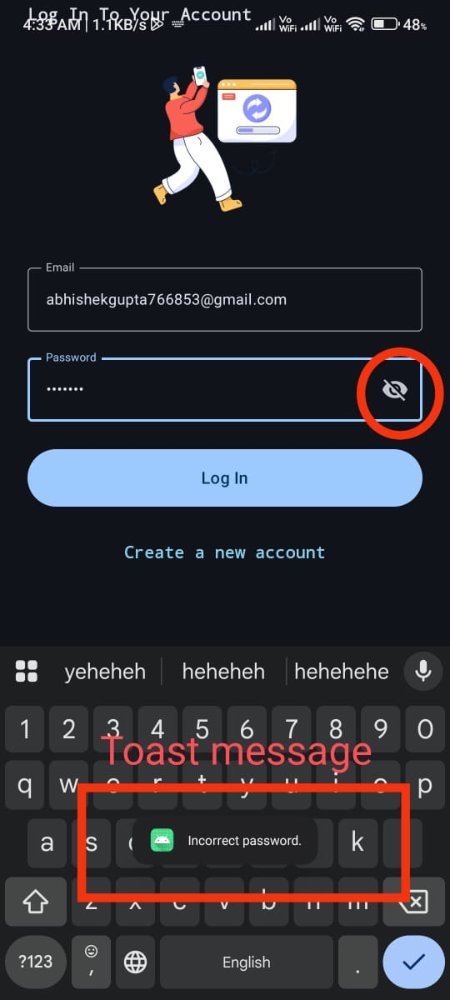
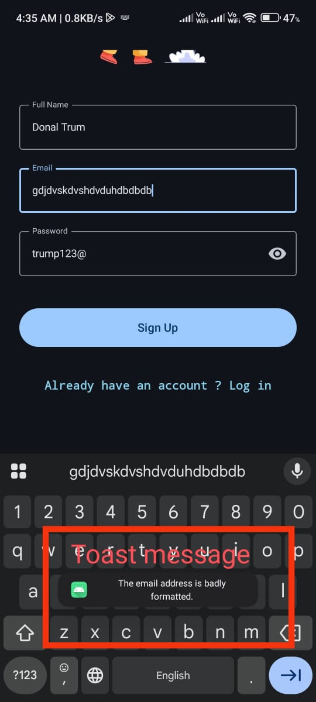
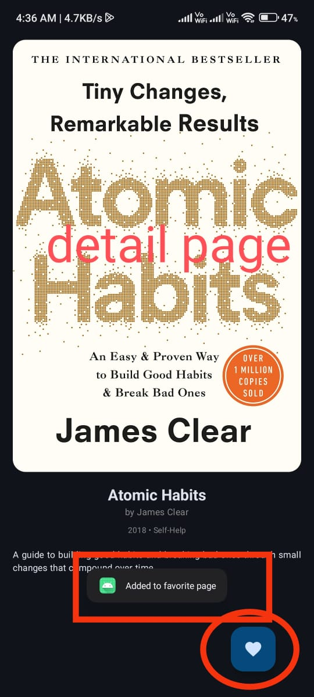
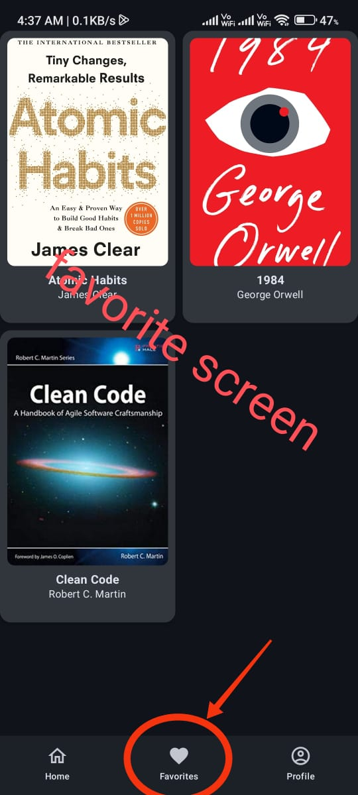
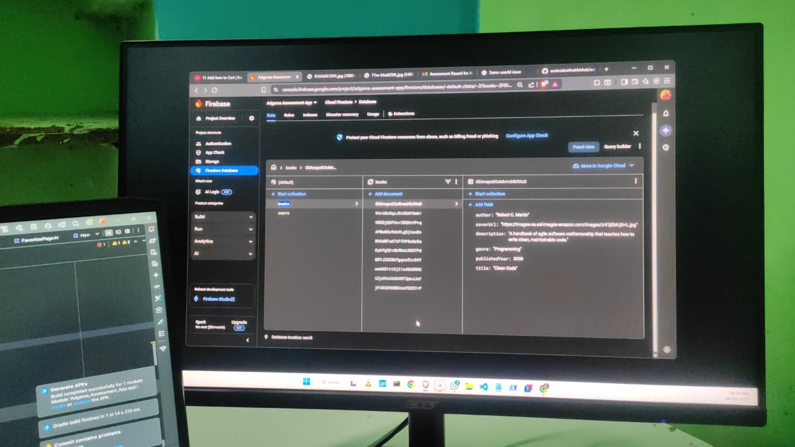

ki## App Screenshots

  <!-- Row 1 -->
  
  
  

  <!-- Row 2 -->
  
  
  
   

  <!-- Row 3 (custom order, rectangular fix) -->
  
 

> All images are fixed to the same **height (200px)** so rectangular ones won’t break the row
> alignment.  
